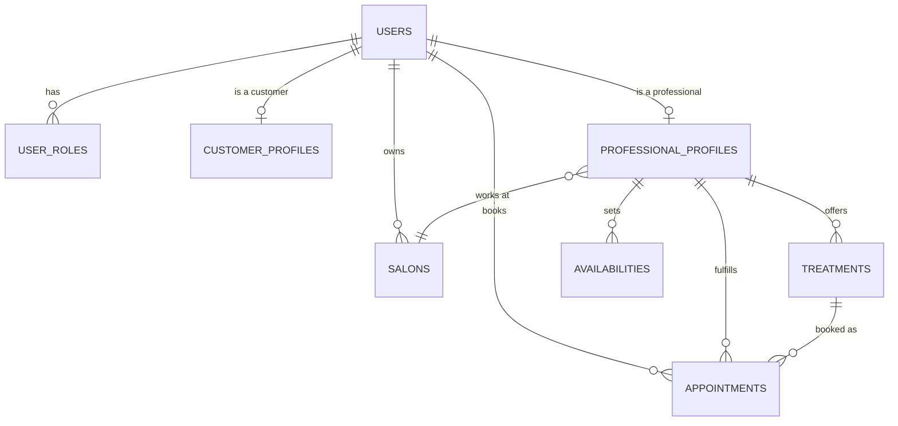

# Kpata — Backend API

Backend REST API for **Kpata**, a booking platform connecting customers with hair &
beauty salons in Côte d'Ivoire — professionals, treatments, availabilities and
appointments, built on a modular-monolith architecture.

[](https://github.com/KyliannIvory/kpata-backend/actions/workflows/ci.yml)
[](https://sonarcloud.io/summary/new_code?id=KyliannIvory_kpata-backend)


## Table of contents

- [Overview](#overview)
- [Tech stack](#tech-stack)
- [Architecture](#architecture)
- [Domain model](#domain-model)
- [API](#api)
- [Getting started](#getting-started)
- [Testing & code quality](#testing--code-quality)
- [CI/CD pipeline](#cicd-pipeline)
- [Project status](#project-status)

## Overview

Kpata connects **customers** looking for a haircut, braids, or a spa treatment with
**professionals** working at a **salon**. A professional publishes the treatments they
offer and their availabilities; customers book an **appointment** against a slot. This
repository is the backend API powering that flow.

## Tech stack

| Layer | Technology |
|---|---|
| Language | Java 21 |
| Framework | Spring Boot 4.0, Spring Modulith 2.0 (module boundaries) |
| Security | Spring Security, stateless JWT ([jjwt](https://github.com/jwtk/jjwt)) |
| Persistence | Spring Data JPA / Hibernate, PostgreSQL 16 |
| Migrations | Flyway |
| Object mapping | MapStruct |
| Validation | Jakarta Bean Validation, [libphonenumber](https://github.com/google/libphonenumber) (Ivory Coast phone format) |
| Testing | JUnit 5, Mockito, AssertJ, MockMvc |
| Code quality | Checkstyle (Google Java Style), JaCoCo, SonarCloud |
| CI/CD | GitHub Actions |
| Build | Maven (wrapper included, no local install needed) |

## Architecture

The application is a **modular monolith**, enforced with [Spring
Modulith](https://spring.io/projects/spring-modulith): each business capability is a
top-level package, and only its non-`internal` classes are visible to other modules —
everything under `<module>.internal` is implementation detail.

```
auth          → accounts, JWT issuing/validation, authentication
profile       → customer & professional profiles
salon         → salons owned by a professional
treatment     → services a professional offers, with price & duration
availability  → time slots a professional publishes
appointment   → a booking made by a customer against a slot
shared        → cross-module building blocks (error contract, base entity, validators)
```

Each module that exposes HTTP endpoints follows the same layering:

```
Controller → Service → Repository → Database
                ↓
             Mapper (entity ↔ DTO, MapStruct)
```

- **Controllers** only translate HTTP ↔ DTOs — no business logic.
- **Services** hold the business rules and are the transaction boundary.
- **DTOs** are the only thing that crosses the HTTP boundary; JPA entities never do.
- Every expected failure (not found, invalid credentials, duplicate account…) is a
  typed subclass of `ApplicationException`, caught once by a single
  `@RestControllerAdvice` (`GlobalExceptionHandler`) and turned into a consistent JSON
  error body — see [`docs/auth.md`](docs/auth.md) for the exact contract.
- Authentication is **stateless**: a `JwtFilter` reads the `Authorization` header on
  every request and populates Spring Security's context; there are no server-side
  sessions.

## Domain model



A `User` can hold multiple roles (`CUSTOMER`, `PROFESSIONAL`, …) and, independently,
own a customer profile, a professional profile, or both — a professional profile
additionally carries a `SalonRole` (`OWNER` or `EMPLOYEE`) describing their standing
within the salon they work at.

## API

| Method | Endpoint | Auth required | Description |
|---|---|:---:|---|
| `POST` | `/auth/signup` | No | Create an account, returns a JWT |
| `POST` | `/auth/login` | No | Authenticate, returns a JWT |
| `POST` | `/auth/logout` | Yes | Revoke the current JWT |
| `GET` | `/auth/me` | Yes | Return the authenticated user |
| `GET` | `/professionals/{userId}` | No | Return a professional's public profile (salon, bio, role) |

Every error response follows the same shape (`timestamp`, `status`, `error`, `message`,
`path`, `fieldErrors`) — see [`docs/auth.md`](docs/auth.md) for details and examples.

## Getting started

**Prerequisites:** JDK 21, Docker & Docker Compose.

```bash
git clone git@github.com:KyliannIvory/kpata-backend.git
cd kpata-backend

# Start PostgreSQL (and pgAdmin, on http://localhost:5050)
docker compose up -d

# Run the app — migrations apply automatically on startup (Flyway)
./mvnw spring-boot:run
```

The API is then available at `http://localhost:8080`. Configuration
(`src/main/resources/application.yaml`) reads these environment variables, with
development-only defaults:

| Variable | Default | Purpose |
|---|---|---|
| `DB_USERNAME` | `admin` | PostgreSQL user |
| `DB_PASSWORD` | `password` | PostgreSQL password |
| `JWT_SECRET` | *(insecure dev value)* | Signing key for issued JWTs — **must** be overridden outside local development |

## Testing & code quality

```bash
./mvnw test                       # unit + controller tests
./mvnw checkstyle:check           # lint (Google Java Style)
./mvnw clean test jacoco:report   # coverage report → target/site/jacoco/index.html
```

- **Service tests** (JUnit 5 + Mockito + AssertJ) isolate business rules from
  persistence and HTTP.
- **Controller tests** (`@WebMvcTest`) run requests through the **real** JWT security
  chain instead of `@WithMockUser`, so they also catch bugs in how tokens are read and
  routes are authorized — not just in the controller's own logic.
- **Mapper tests** exercise the MapStruct-*generated* implementation directly, since
  mocking the mapper interface elsewhere would otherwise leave that generated code
  never actually run.

## CI/CD pipeline

Every push and pull request to `main` runs three sequential GitHub Actions jobs:

1. **`lint`** — `checkstyle:check` (Google Java Style)
2. **`build-and-test`** — full build, test suite, JaCoCo coverage report
3. **`sonar`** — SonarCloud quality gate, using the coverage report from step 2

## Project status

**Implemented and exposed via the API:**
- Account creation, login, logout, and current-user lookup (JWT-based auth)
- Public professional profile lookup by user id

**Modeled in the database, not yet exposed via the API:**
- Salons, treatments, availabilities, appointments, customer profiles

**Known next steps:**
- Expose salon, treatment, availability and appointment endpoints
